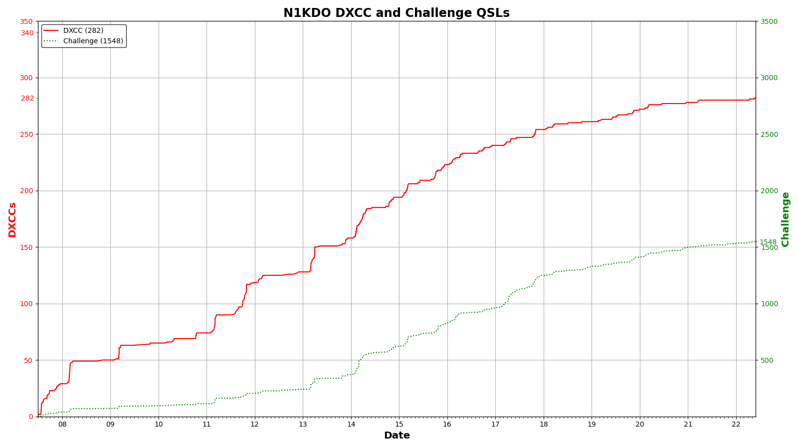
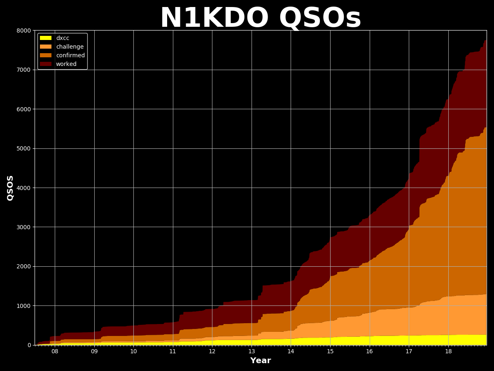
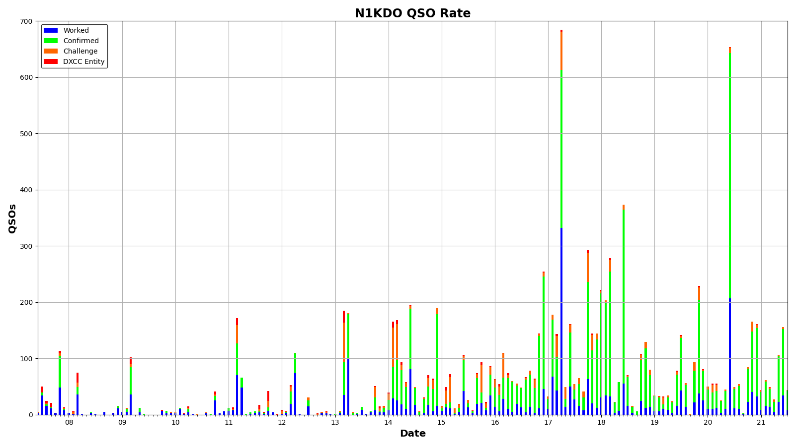
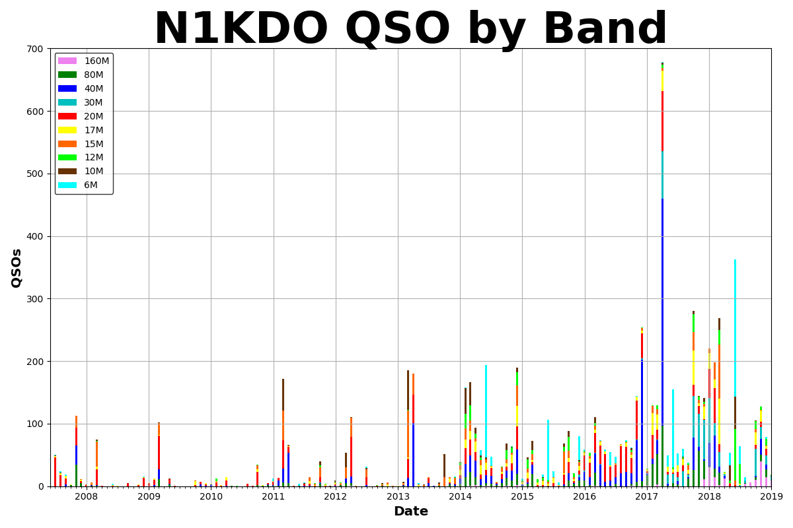
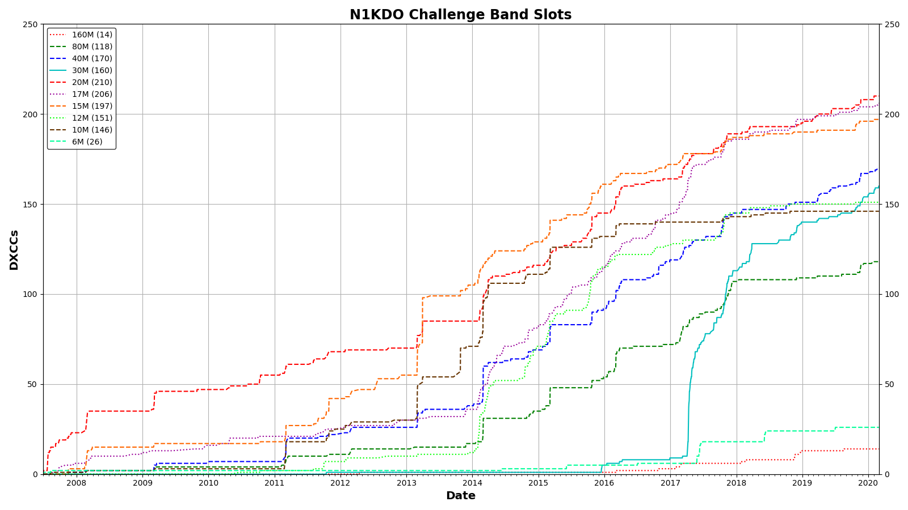
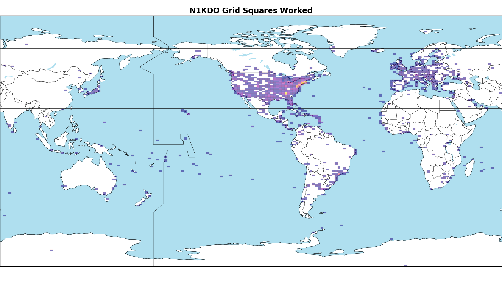

# adif-log-analyzer

`adif-log-analyzer` shows you DXCC QSO progress over time.

This python script can connect to Logbook of the World and download ADIF files for you,
or it can import an ADIF file you have in hand.  I have tested it with DXKeeper ADIF, it works with that, too.

It uses Matplotlib to make some graphics that show your DXCC progress (as well as total QSOS)
over time.

I might do more work on this, or I might not.
 
I'm putting it on GitHub because others might find it useful.

It is still very much a work-in-progress.  

n1kdo 20200621
