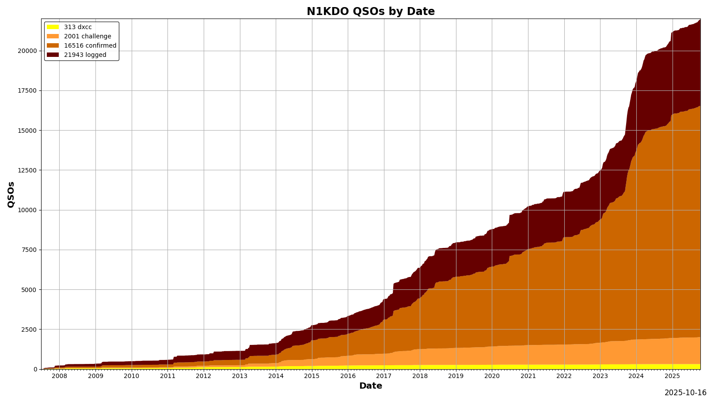
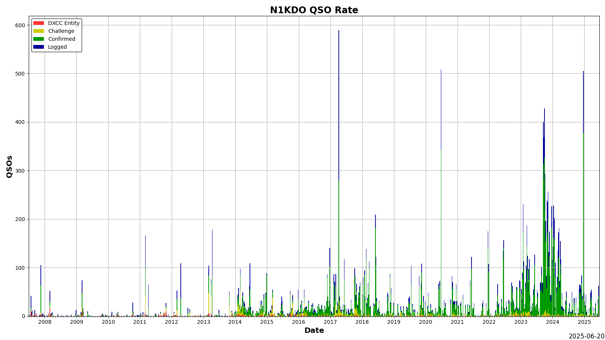
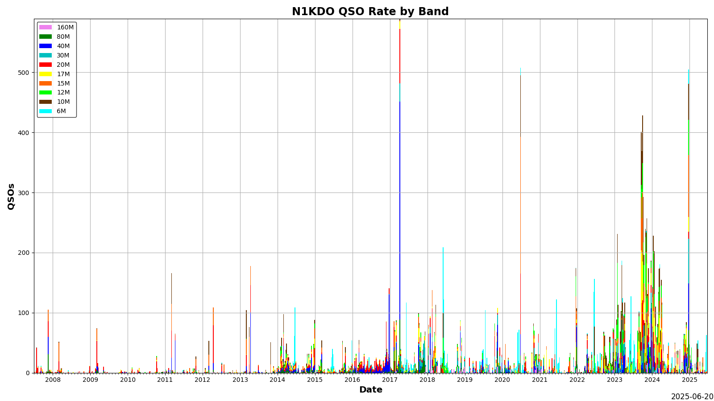
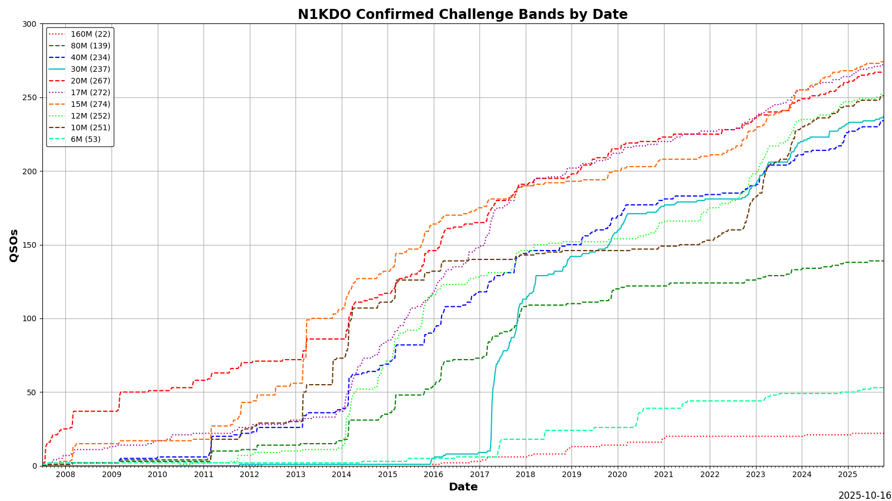

# adif-log-analyzer

`adif-log-analyzer` shows your DXCC QSO progress over time.

There are two scripts of interest here:

The 'get_lotw_adif.py' script can connect to Logbook of the World and download (and update) ADIF files for you, and
it can download your DXCC "cards" file for all contacts that are confirmed by the DXCC desk.

The 'adif_log_analyzer.py' script will read and crunch the data in the specified ADIF file and create
some useful charts from that information.  It can accept LoTW adif, the adif from the 'get_lotw_adif' script, and
it can use DXKeeper ADIF, too.

It uses Matplotlib to make some graphics that show your DXCC progress (as well as total QSOS)
over time.

I might do more work on this, or I might not.
 
I'm putting it on GitHub because others might find it useful.

It is still very much a work-in-progress.  

### To Run in Docker

`docker build -t lotw .`
`docker run -v output:/app/output/ -it lotw`

n1kdo 20230331

